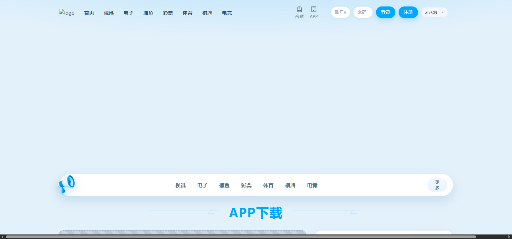
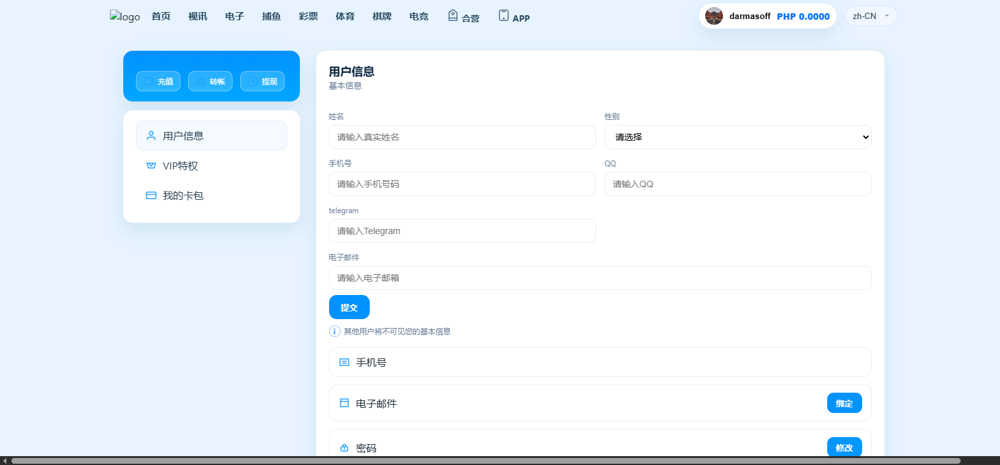
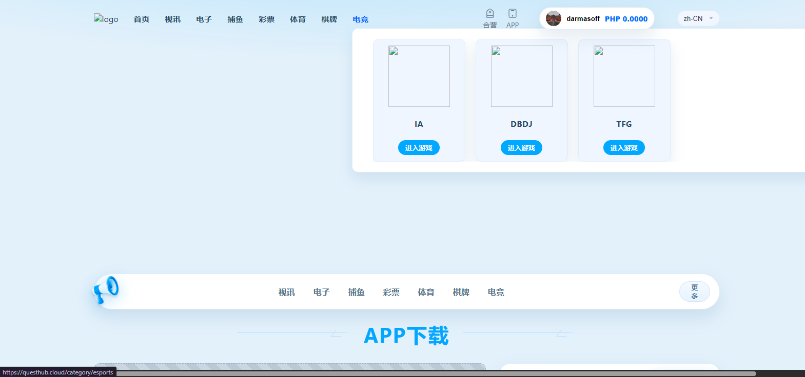

# UA_Freelancehunt_SiteClone

Комерційний клон сайту, виконаний на замовлення через Freelancehunt. Основна задача — акуратно відтворити інтерфейс і ключовий функціонал референс-сайту.  
**Технології:** PHP, JavaScript, HTML, CSS.

> ⚠️ Проєкт створений як робота під замовлення. Репозиторій публікується для портфоліо/демо. Не афілійований з оригінальним брендом; торгові марки належать їхнім власникам.

---

## Стек
- **Backend:** PHP (роутер, базова бізнес-логіка)
- **Frontend:** HTML/CSS, JS
- **Інше:** `.htaccess` для роутингу, SQL дамп для структури БД

- ## Скриншоти

  
  
  

(Файли лежать у `screenshots/` — назви чутливі до регістру: **Screenshot_66.png**, **Screenshot_68.png**, **Screenshot_69.png**.)

---

## Ліцензія
**Proprietary — All rights reserved.** Див. файл [LICENSE](LICENSE).  
Код надано виключно для перегляду в портфоліо; повторне використання, копіювання чи публічне розповсюдження заборонені без письмового дозволу.

---
